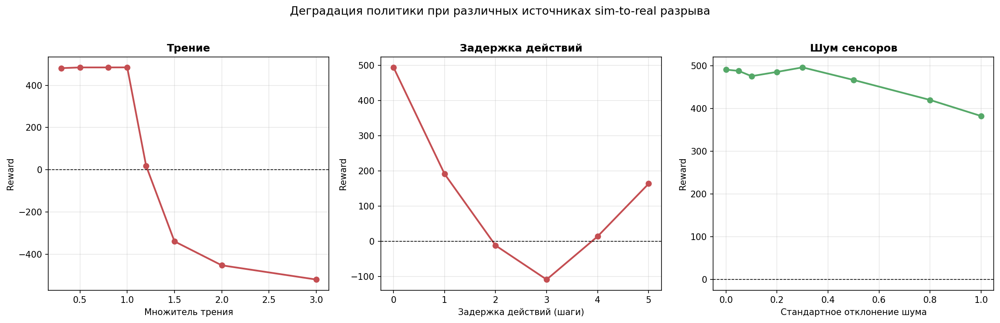

# RL-locomotion-planning-test-task
Тестовое задание: анализ открытой проблемы в RL-планировании и управлении шагающими роботами, формулировка гипотезы и воспроизведение baseline
# Sim-to-Real Gap в RL для шагающих роботов: постановка проблемы

## 1. Суть проблемы

Обучение с подкреплением для шагающих роботов почти всегда происходит 
в симуляторе: обучение в реальном мире опасно, дорого и медленно. 
Однако политика, обученная в симуляторе, при переносе на реального 
робота теряет производительность — вплоть до полного отказа. Этот 
разрыв между симуляцией и реальностью называется sim-to-real gap.

Формально gap определяется как разница в производительности политики, 
обученной в симуляторе $\mathcal{M}_s$, при её оценке в реальной среде 
$\mathcal{M}_r$ (Da et al., 2025):

$$G(\pi) := \psi_s(\pi_s^i) - \psi_r(\pi_s^i) \mid \pi_s^i \sim \mathcal{M}_s$$

где $\psi$ — метрика качества политики, откалиброванная и применённая 
одинаково в симуляторе и в реальности.

Ключевое: разрыв возникает не в момент деплоя, а закладывается ещё 
на этапе обучения — из-за несоответствия между симулятором и 
реальностью по четырём элементам MDP:

| Элемент MDP | Источник разрыва |
|---|---|
| **Observation** | Шум сенсоров, неполнота данных, разница в разрешении и представлении признаков |
| **Action** | Задержки приводов, дискретизация, разница между дискретным (sim) и непрерывным (real) пространством действий |
| **Transition** | Разница в динамике: трение, масса, упругость, жёсткость контакта |
| **Reward** | Несоответствие между симулированными и реальными критериями успеха |

## 2. Почему для шагающих роботов это особенно критично

Для шагающих роботов наиболее критичен Transition gap — разница 
в динамике переходов между состояниями. В симуляторе физические 
параметры (трение, масса, задержки приводов) фиксированы и 
идеализированы, тогда как в реальном мире они варьируются и часто 
неизвестны.

Как отмечают авторы обзора Da et al. (2025):

> The dynamic systems difference causes the challenge for policy learning 
> and especially the deployment in $E_{real}$.

Конкретные формы этого разрыва для шагающих роботов:

- **Разрыв в динамике контакта.** Симуляторы используют упрощённые 
  модели трения и жёсткости. В реальности контакт стопы с поверхностью 
  зависит от материала покрытия, его влажности, температуры и степени 
  износа.
- **Задержки и неидеальность приводов.** В симуляторе действие 
  исполняется мгновенно и точно. В реальности между командой и движением 
  сустава есть задержка, а сам привод имеет люфт, насыщение и 
  нелинейности.
- **Несоответствие наблюдений.** Реальные датчики (IMU, энкодеры, 
  контактные сенсоры) дают шум, смещение и задержки, которых нет в 
  симуляторе.

## 3. Существующие решения и их ограничения

В обзоре Da et al. (2025) методы решения sim-to-real проблемы 
систематизированы по четырём элементам MDP.

### Observation

- **Domain randomization** — рандомизация текстур, освещения, позиций 
  объектов, параметров камеры. Цель: политика не переобучается под 
  конкретную визуальную конфигурацию.
- **Domain adaptation** — выравнивание распределений признаков между 
  симулятором и реальностью через adversarial training или выравнивание 
  эмбеддингов.
- **Sensor fusion** — объединение данных с нескольких сенсоров для 
  компенсации ограничений каждого.
- **Foundation models** (LLM/VLM) — построение семантических якорей, 
  инвариантных между симуляцией и реальностью.

### Action

- **Action space scale** — переход от дискретного пространства действий 
  в симуляторе к непрерывному в реальности. Методы: subgoal-модели, 
  action shielding (фильтрация небезопасных действий).
- **Action delays** — учёт задержек через модели предсказания (DCAC, 
  PAD), буферы действий или модификацию Q-обучения (D-SARSA, D-Q, 
  Delayed-Q).
- **Action uncertainty** — action advising (запрос подсказки у более 
  опытного агента), action robust RL (обучение с учётом того, что 
  действие может быть заменено на adversarially выбранное).

### Transition

- **Domain randomization** по физическим параметрам (трение, крутящий 
  момент, масса) — самый распространённый метод.
- **Domain adaptation** — выравнивание распределений параметров между 
  доменами.
- **Grounding methods** — GAT, SGAT, RGAT, GARAT: обучение 
  трансформации действий, чтобы динамика симулятора соответствовала 
  реальности.
- **Distributionally robust learning** — теоретически обоснованные 
  методы, гарантирующие устойчивость политики при ограниченном сдвиге 
  динамики.
- **LLM-enhanced approaches** — использование LLM для улучшения 
  forward-модели, предсказывающей реальную динамику.

### Reward

- **Reward shaping** — potential-based, automaton-guided, assistant 
  reward agents.
- **LLM-based reward design** — автоматическая генерация функций 
  награды из текстового описания задачи (CARD, Text2Reward, 
  эволюционный дизайн награды).

## 4. Пробел: что остаётся открытым

Ни один из перечисленных методов не решает проблему полностью.

В обзоре Da et al. (2025) прямо отмечено, что большая часть работ 
сосредоточена на **внешних** возмущениях — шум сенсоров, ветер, 
неровности рельефа, — тогда как **внутренние** возмущения остаются 
практически не изученными:

- деградация актуаторов;
- дрейф параметров;
- неидеальность приводов;
- износ механических компонентов.

Это делает проблему устойчивости RL-политик к изменению динамики 
**открытой и актуальной**.

## 5. Формулировка проблемы

Обучение с подкреплением для шагающих роботов почти всегда происходит 
в симуляторе, потому что обучение в реальном мире опасно, дорого 
и медленно. Однако политика, обученная в симуляторе, при переносе 
на реального робота теряет производительность — вплоть до полного 
отказа. Этот разрыв между симуляцией и реальностью (sim-to-real gap) 
остаётся нерешённой проблемой.

Разрыв проявляется в том числе в хрупкости политик к изменению 
физических параметров: политика, обученная при одних значениях трения, 
массы или задержек, теряет производительность при других. Причины — 
несоответствие динамики контакта, задержки приводов и шум сенсоров, 
которые в симуляторе либо идеализированы, либо отсутствуют.

## 6. Математическая постановка задачи

Задача управления шагающим роботом формализуется как марковский 
процесс принятия решений (MDP):

$$\mathcal{M} = (\mathcal{S}, \mathcal{A}, \mathcal{T}, \mathcal{R}, \gamma)$$

где:
- $\mathcal{S}$ — пространство состояний (положения и скорости суставов, ориентация корпуса, контактные силы);
- $\mathcal{A}$ — пространство действий (целевые углы или моменты для каждого сустава);
- $\mathcal{T}: \mathcal{S} \times \mathcal{A} \to \Delta(\mathcal{S})$ — функция переходов, задающая распределение следующего состояния;
- $\mathcal{R}: \mathcal{S} \times \mathcal{A} \times \mathcal{S} \to \mathbb{R}$ — функция награды;
- $\gamma \in [0, 1)$ — коэффициент дисконтирования.

Цель обучения — найти политику $\pi: \mathcal{S} \to \mathcal{A}$, максимизирующую 
ожидаемую дисконтированную награду:

$$J(\pi) = \mathbb{E}_{(s, a) \sim \mu^\pi} \left[ \sum_{t} \gamma^t r_t \right]$$

Sim-to-real gap возникает из-за несоответствия между MDP симулятора 
$\mathcal{M}_s$ и MDP реального мира $\mathcal{M}_r$ по всем четырём 
элементам:

$$\mathcal{S}_s \neq \mathcal{S}_r, \quad \mathcal{A}_s \neq \mathcal{A}_r, 
\quad \mathcal{T}_s \neq \mathcal{T}_r, \quad \mathcal{R}_s \neq \mathcal{R}_r$$

Для шагающих роботов наиболее критичны несоответствия в функции 
переходов $\mathcal{T}$ и пространстве действий $\mathcal{A}$:

- **Динамика контакта** ($\mathcal{T}$): симуляторы используют 
  упрощённые модели трения и жёсткости; в реальности контакт зависит 
  от материала покрытия, влажности, температуры, износа.
- **Задержки приводов** ($\mathcal{A}$): в симуляторе действие 
  исполняется мгновенно; в реальности между командой и движением 
  сустава есть задержка.
- **Неидеальность приводов** ($\mathcal{A}$): люфт, насыщение, 
  нелинейности, которые редко моделируются.
- **Шум сенсоров** ($\mathcal{S}$): реальные IMU, энкодеры и контактные 
  сенсоры дают шум и смещение, которых нет в симуляторе.
- **Разница в массе и инерции** ($\mathcal{T}$): реальная сборка 
  отличается от симулированной модели.

Разрыв формально выражается как разница в производительности политики, 
обученной в $\mathcal{M}_s$, при оценке в $\mathcal{M}_r$:

$$G(\pi) = \psi_s(\pi) - \psi_r(\pi)$$

где $\psi_s$ и $\psi_r$ — метрики качества в симуляторе и реальности 
соответственно (Da et al., 2025).

## 7. Бенчмарк и план эксперимента

Полное воспроизведение всех источников разрыва между симуляцией 
и реальностью требует доступа к реальному роботу. Поэтому в рамках 
данного задания разрыв воспроизводится в контролируемых условиях — 
это подход Sim-to-Sim evaluation: политика обучается при одних 
физических параметрах $\mathcal{M}_s$ и оценивается при других 
$\mathcal{M}_r'$.

### Выбор среды

В качестве бенчмарка используется **HalfCheetah-v4** из MuJoCo Gym Suite. 
Это стандартная среда для тестирования RL-алгоритмов в задачах 
управления движением, которая широко применяется в исследованиях 
по sim-to-real (Da et al., 2025; Todorov et al., 2012).

HalfCheetah — это упрощённая 2D-модель с четырьмя конечностями. 
Она не является двуногим гуманоидом, но обладает рядом свойств, 
которые делают её удобной для воспроизведения проблемы:

- **Быстрое обучение.** PPO сходится за 100k шагов на CPU, что позволяет 
  провести полный эксперимент за один день.
- **Стабильность.** Среда детерминирована и хорошо изучена, что снижает 
  риск того, что деградация политики будет вызвана нестабильностью 
  обучения, а не изменением параметров.
- **Управляемые физические параметры.** Трение, масса и задержки можно 
  менять через обёртки, не переписывая модель.
- **Стандартные метрики.** Reward на HalfCheetah — общепринятая метрика, 
  с которой можно сравнивать результаты.

### Оговорка о переносимости на гуманоидов

HalfCheetah — это четвероногая платформа, а не двуногий гуманоид. 
Однако для гуманоидов разрыв между симуляцией и реальностью стоит 
**острее**:

- выше центр масс и меньше площадь опоры — политика менее устойчива 
  к возмущениям;
- больше управляемых суставов (десятки вместо нескольких) — обучение 
  менее стабильно;
- выше требования к точности динамики контакта — малейшее расхождение 
  в модели трения приводит к падению.

Поэтому HalfCheetah используется как **минимальная тестовая платформа**: 
если проблема хрупкости проявляется уже здесь, то для более сложных 
систем — гуманоидов — она будет ещё серьёзнее.

### Что именно воспроизводится

В эксперименте проверяются три источника разрыва, каждый соответствует 
одному из элементов MDP:

| Источник разрыва | Элемент MDP | Что меняется | Обёртка |
|---|---|---|---|
| Трение | Transition ($\mathcal{T}$) | Динамика контакта | `FrictionWrapper` |
| Задержка действий | Action ($\mathcal{A}$) | Время отклика привода | `ActionDelayWrapper` |
| Шум сенсоров | Observation ($\mathcal{S}$) | Качество входных данных | `SensorNoiseWrapper` |

### Параметры sweep

Для каждого источника проводится постепенное изменение параметра.

**Трение** — множитель коэффициента трения пола:
$$f \in \{0.3, 0.5, 0.8, 1.0, 1.2, 1.5, 2.0, 3.0\}$$

**Задержка действий** — количество шагов, на которое задерживается 
действие:
$$d \in \{0, 1, 2, 3, 4, 5\}$$

**Шум сенсоров** — стандартное отклонение гауссова шума, добавляемого 
к наблюдениям:
$$\sigma \in \{0.0, 0.05, 0.1, 0.2, 0.3, 0.5, 0.8, 1.0\}$$

### Протокол оценки

Для каждого значения параметра политика оценивается на **30 эпизодах**. 
Метрика — **средний reward** и стандартное отклонение. Оценка проводится 
через `evaluate_policy` из Stable-Baselines3, что обеспечивает 
воспроизводимость.

## 8. Реализация

Весь пайплайн реализован в одном Colab-ноутбуке:

**Структура ноутбука:**

1. Установка зависимостей — `gymnasium[mujoco]`, `stable-baselines3[extra]`
2. Обучение baseline-политики PPO на HalfCheetah-v4 (100k шагов)
3. Оценка baseline через `evaluate_policy`
4. Обёртки для трёх источников разрыва
5. Sweep по трению, задержке, шуму
6. Построение графиков деградации
7. Сохранение результатов

**Ключевые технические детали:**

- `env.unwrapped.model` — доступ к MuJoCo-модели. Обёртки Gymnasium 
  (`TimeLimit`, `OrderEnforcing`) не имеют атрибута `model`, поэтому 
  нужно обращаться через `unwrapped`.
- `model.geom_friction` — массив трения для всех геометрий. 
  Пол — `floor`, его трение хранится по индексу `[0]`.
- `evaluate_policy` — стандартная утилита Stable-Baselines3, 
  запускает политику `n_eval_episodes` раз и возвращает среднее 
  и стандартное отклонение награды.

  ## 9. Результаты

### Baseline

Средний reward обученной политики в нормальных условиях: 
**497.57 ± 47.22** (30 эпизодов).

Разброс умеренный: политика работает стабильно в номинальных условиях. 
Это точка отсчёта для оценки деградации.

### Деградация при изменении параметров

#### Трение — резкое пороговое поведение

| Множитель | Reward | Изменение |
|---|---|---|
| 0.3× | 481.16 ± 71.85 | −3.3% |
| 0.5× | 484.61 ± 47.80 | −2.6% |
| 0.8× | 484.61 ± 47.14 | −2.6% |
| 1.0× | 484.87 ± 58.11 | −2.6% |
| 1.2× | 18.46 ± 251.54 | −96.3% |
| 1.5× | −338.99 ± 403.31 | −168.1% |
| 2.0× | −452.27 ± 314.33 | −190.9% |
| 3.0× | −519.67 ± 305.38 | −204.4% |

До 1.0× политика работает стабильно — reward держится около 485. 
После 1.0× — резкий обрыв: при 1.2× теряется 96% производительности, 
при 1.5× reward уходит в отрицательную зону, при 3.0× падает до −520.

**Интерпретация.** Порог деградации находится между 1.0× и 1.2×. 
Политика не обучена работать с трением выше этого значения. 
Большой разброс при 1.2× (±252) говорит о том, что в некоторых 
эпизодах политика ещё держится, а в некоторых — полностью 
разваливается. Это классическое пороговое поведение: хрупкость 
не линейна, есть точка, за которой устойчивость теряется.

#### Задержка действий — провал и частичное восстановление

| Задержка | Reward | Изменение |
|---|---|---|
| 0 | 494.15 ± 34.75 | −0.7% |
| 1 | 191.50 ± 36.62 | −61.5% |
| 2 | −11.85 ± 32.53 | −102.4% |
| 3 | −108.60 ± 203.25 | −121.8% |
| 4 | 14.08 ± 88.25 | −97.2% |
| 5 | 163.77 ± 46.41 | −67.1% |

При задержке 1 шаг reward падает с 494 до 191. При d=2 — уходит 
в отрицательную зону (−12), при d=3 — минимален (−109). Но при 
d=4–5 начинается восстановление: 14 и 164.

**Интерпретация.** Провал при d=2–3 — самый глубокий. Однако 
при d=4–5 политика частично восстанавливается. Это указывает 
на перестройку стратегии управления: при больших задержках 
политика, вероятно, переходит в режим, близкий к открытому 
контуру, и находит более инерционные паттерны движения. Полного 
восстановления до baseline не происходит, но тренд на рост — 
устойчивый.

#### Шум сенсоров — плавная деградация

| Шум | Reward | Изменение |
|---|---|---|
| 0.0 | 490.70 ± 53.33 | −1.4% |
| 0.05 | 487.74 ± 47.92 | −2.0% |
| 0.1 | 475.42 ± 60.62 | −4.5% |
| 0.2 | 485.36 ± 47.54 | −2.5% |
| 0.3 | 495.97 ± 34.50 | −0.3% |
| 0.5 | 466.55 ± 44.92 | −6.2% |
| 0.8 | 419.77 ± 47.60 | −15.6% |
| 1.0 | 382.25 ± 53.80 | −23.2% |

До std=0.3 шум практически не влияет. При std=0.5 — падение 
на 6%. При std=1.0 — падение на 23%, но политика всё ещё 
работает.

**Интерпретация.** Observation gap для HalfCheetah оказался 
наименее критичным. Политика PPO устойчива к шуму сенсоров 
в широком диапазоне. Даже при std=1.0 reward остаётся 
положительным и составляет около 77% от baseline.

### Сводная таблица

| Источник разрыва | Худший reward | Изменение | Характер |
|---|---|---|---|
| Трение (3.0×) | −519.67 | −204.4% | Пороговый обрыв после 1.0× |
| Задержка (3 шага) | −108.60 | −121.8% | Провал с частичным восстановлением |
| Шум (1.0) | 382.25 | −23.2% | Плавная деградация |

### Графики

### Вывод

Динамические источники разрыва (трение, задержка) оказались 
критичнее наблюдательного (шум). Трение приводит к полному отказу 
политики при значениях выше 1.0× — reward уходит в отрицательную 
зону и продолжает падать. Задержка даёт провал при d=2–3 с 
частичным восстановлением при d=4–5. Шум сенсоров снижает 
производительность плавно и не ломает политику полностью.

Это согласуется с обзором Da et al. (2025), где отмечено, что 
transition gap и action gap для шагающих роботов представляют 
наибольшую сложность, тогда как observation gap менее критичен.

**Три ключевых наблюдения:**

1. **Трение имеет критический порог.** До 1.0× политика работает 
   стабильно, после — резко деградирует. Хрупкость не линейна: 
   есть точка, за которой устойчивость теряется полностью.

2. **Задержка действий даёт немонотонный эффект.** При d=2–3 
   reward минимален, но при d=4–5 частично восстанавливается. 
   Это указывает на перестройку стратегии управления, а не просто 
   на деградацию. Это самое неочевидное наблюдение и потенциально 
   самое ценное для дальнейшего исследования.

3. **Шум сенсоров деградирует плавно.** Даже при std=1.0 политика 
   сохраняет ~77% производительности. Observation gap для этой 
   платформы менее критичен, чем transition и action gap.

### Связь с исследованиями на гуманоидах

Полученные результаты согласуются с тем, что известно о sim-to-real 
разрыве для гуманоидных роботов. В литературе отмечено, что для 
гуманоидов разрыв стоит острее, чем для четвероногих: выше центр масс, 
меньше площадь опоры, выше требования к точности динамики контакта. 
Это объясняет, почему domain randomization по трению и задержке 
действий стал стандартной практикой именно для гуманоидов.

В PolySim для гуманоида Unitree G1 параллельно используются несколько 
симуляторов (IsaacSim, IsaacGym, Genesis) с рандомизацией динамики, 
что позволяет выполнять zero-shot перенос на реального робота. 
В работах по обучению гуманоидов dribbling с рандомизацией задержки 
сенсоров и трения система стабилизируется за счёт включения 
характеристик реальных сенсоров в симуляцию. Это подтверждает, 
что задержка является критичным источником разрыва для гуманоидов.

Наблюдение о частичном восстановлении при больших задержках (d=4–5) 
перекликается с исследованиями по whole-body MPC для гуманоидов. 
На роботе TALOS было показано, что задержка вычислений в torque-контроле 
может дестабилизировать систему, и требуются специальные компенсационные 
меры. Это указывает на то, что задержка — не просто шум, а фактор, 
меняющий режим управления.

Шум сенсоров, показавший слабый эффект на HalfCheetah, также имеет 
аналог в гуманоидных исследованиях. В работах для Unitree G1 
рандомизация наблюдений используется для zero-shot переноса, 
но основной акцент делается на динамику, а не на шум. Это согласуется 
с выводом о том, что transition gap и action gap доминируют 
над observation gap.

## 10. Гипотезы

Результаты, полученные на HalfCheetah-v4, нельзя напрямую переносить 
на гуманоидов. Соотношение критичности источников разрыва может быть 
иным: у гуманоида выше центр масс, меньше площадь опоры, больше 
управляемых суставов. Поэтому гипотезы ниже формулируются **в рамках 
данной платформы** и проверяются на ней же. Перенос методологии 
на гуманоидные платформы — отдельная задача.

### Гипотеза 1: Задержка как кросс-робастный регуляризатор

**Наблюдение.** При задержке 2–3 шага reward уходит в отрицательную 
зону (−12 и −109), но при d=4–5 начинается восстановление: 14 и 164. 
Это устойчивый паттерн, подтверждённый на 30 эпизодах.

**Гипотеза.** Обучение с большой задержкой действий (d=4–5) может 
работать как кросс-робастный регуляризатор, повышая устойчивость 
политики не только к задержке, но и к другим источникам разрыва — 
трению и шуму сенсоров.

**Проверка.** Обучить PPO только с d=5, протестировать при трении 
2.0× и шуме 1.0, сравнить с baseline и с полным domain randomization.

**Почему это открыто.** В литературе задержка рассматривается как 
отдельный источник разрыва, требующий своей рандомизации. 
Кросс-робастный эффект задержки систематически не исследовался. 
Если обучение с большой задержкой даёт устойчивость к другим 
источникам — это меняет стратегию выбора методов.

### Гипотеза 2: Направленная рандомизация вместо равномерной

**Наблюдение.** Порог деградации по трению находится между 1.0× 
и 1.2×. Значения ниже 1.0× не влияют на производительность. 
Значения выше 2.0× — катастрофа. Критическая зона узкая.

**Гипотеза.** Рандомизация, сфокусированная на критической зоне 
(вместо равномерного покрытия всего диапазона), даст лучший 
компромисс между робастностью и оптимальностью. Равномерный 
domain randomization тратит бюджет обучения на неважные значения.

**Проверка.** Обучить PPO с domain randomization, где трение 
выбирается из [0.8×, 1.5×] (критическая зона), вместо [0.5×, 2.0×]. 
Сравнить с обычным domain randomization по baseline reward 
и робастности.

**Почему это открыто.** В литературе domain randomization обычно 
равномерный. Если фокусировка на критической зоне работает лучше — 
это новый подход к выбору диапазона, который снижает вычислительную 
стоимость и повышает эффективность.

### Гипотеза 3: Асимметрия направления разрыва

**Наблюдение.** В эксперименте политика обучалась в номинальных 
условиях и деградировала при изменении параметров. Но направление 
изменения не проверялось: политика, обученная при высоком трении, 
не тестировалась при низком, и наоборот.

**Гипотеза.** Разрыв асимметричен: политика, обученная при высоком 
трении, будет лучше работать при низком, чем политика, обученная 
при низком, — при высоком. Это означает, что направление domain 
randomization имеет значение, и что некоторые направления переноса 
легче других.

**Проверка.** Обучить две политики: одну при трении 2.0×, другую 
при 0.5×. Протестировать каждую в обеих условиях. Сравнить 
матрицу переноса.

**Почему это открыто.** Bi-directional domain adaptation упоминается 
в обзорах (Da et al., 2025), но асимметрия разрыва для конкретных 
источников систематически не измерялась. Если асимметрия есть, 
это позволяет выбирать направление обучения осознанно.

### Ограничение

Все гипотезы сформулированы для HalfCheetah-v4. Они не утверждают, 
что аналогичная картина наблюдается на гуманоидах. Методология, 
отработанная в данном эксперименте (sweep по параметрам, сравнение 
с baseline, оценка на 30 эпизодах), может быть перенесена 
на гуманоидные платформы без изменений.

Проверка этих гипотез выходит за рамки данного задания 
и является направлением дальнейшей работы.

## Список литературы

1. Da, L., Turnau, J., Kutralingam, T. P., Velasquez, A., Shakarian, P., Wei, H. (2025). Обзор методов sim-to-real в обучении с подкреплением: прогресс, перспективы и вызовы с фундаментальными моделями. arXiv:2502.13187.

2. Zhou, Z., et al. (2025). PolySim: Преодоление разрыва между симуляцией и реальностью для управления гуманоидами через мульти-симуляторную рандомизацию динамики.

3. Todorov, E., Erez, T., Tassa, Y. (2012). MuJoCo: физический движок для управления на основе моделей. In IEEE/RSJ International Conference on Intelligent Robots and Systems (IROS), pp. 5026–5033.

4. Schulman, J., Wolski, F., Dhariwal, P., Radford, A., Klimov, O. (2017). Алгоритмы проксимальной оптимизации политики. arXiv:1707.06347.
